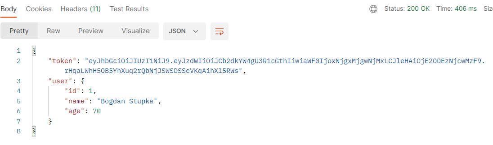
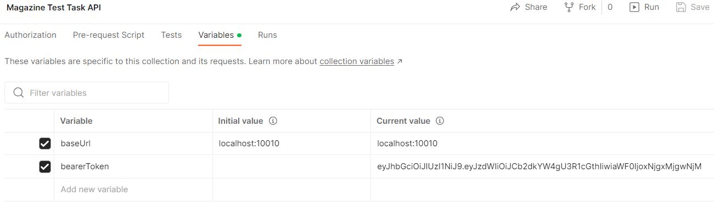

# Magazine Test Task

### Description
This application is the *Test task* for the position of **Junior Java Software Engineer**

## Features to do
The application needs to be made as a server on the following technologies:
- Java 8 
- Spring Boot
- Spring Data
- Apache Maven 
- In-memory database (H2)

We have a database. In the database there is a relationship *one-to-many* between `User` and `Article`.
`User` has the following fields: `id`, `name`, `age`. 
`Article` has the following fields: `id`, `text`, `color` (*enum*). 
At the start of the application 5-10 random `Users` with `Articles` should be added to the database.
It is needed to make the following API:
1. Get all `Users` whose `age` is greater than some value
2. Get all `Users` with `Articles`, in which `color` is some certain value from *enum*
3. Get unique `names` from 'Users' that have more than 3 (or some value) `Articles`
4. Store `User`
5. Store `Article`
6. Implement JWT-based security
7. Also need to write 1-2 JUnit-tests for any of these API methods (on controllers, on services, on the DAO-layer)

Upload this code to *GitHub* and write a *README* how to run a project. 
Create a collection in Postman or write queries using the *curl* tool so that it can be easily tested 
(write it in the *README* or any other known way)

### How to run this application
- Clone or download repository
- Import *Postman* collection from this URL:
  > https://api.postman.com/collections/3959105-1c78d2b2-947d-4fa7-91cb-71f9b883adab?access_key=PMAT-01GXQGRHTRR8CCFBSZERQJJPQ4
  
  Do  `Menu -> File -> Import...`
- Run `Application.main`. The database will be automatically raised into memory 
  and initialized with the initial values
- Go to *Postman* and Enjoy!

### Note
To use *Postman* correctly should first *register* or *log in* using API and then copy the received *token*, for example

